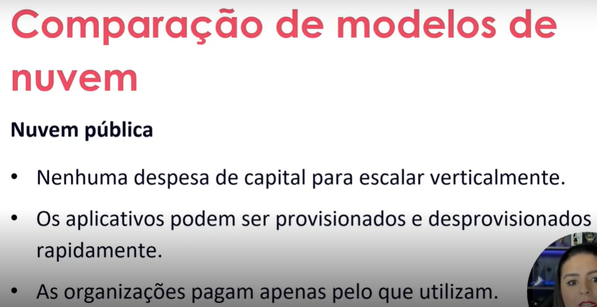
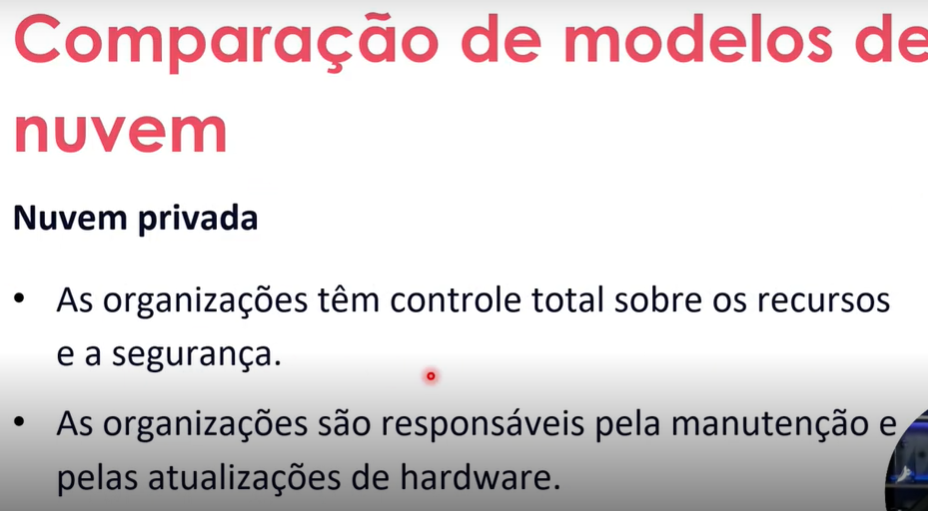

# Laboratório de Máquina Virtual no Microsoft Azure

Este repositório documenta meu processo de aprendizado e implementação de máquinas virtuais na plataforma Microsoft Azure, contendo resumos, anotações e dicas práticas.

## 📝 Conteúdo do Repositório
- `README.md`: Documentação principal (este arquivo)
- `/images`: Capturas de tela relevantes
- `cheatsheet-azure-vm.md`: Comandos úteis e dicas rápidas

  ### Tipos de Nuvens



## 🔍 Passo a Passo para Criação de VM no Azure

### 1. Pré-requisitos
- Conta ativa no [Azure Portal](https://portal.azure.com)
- Assinatura habilitada
- Acesso ao [Cloud Shell](https://shell.azure.com) ou Azure CLI

### 2. Criando uma VM via Portal
```mermaid
graph TD
    A[Portal Azure > Criar recurso] --> B[Selecionar 'Máquina Virtual']
    B --> C[Configurar parâmetros básicos]
    C --> D[Escolher imagem do SO]
    D --> E[Selecionar tamanho da instância]
    E --> F[Configurar credenciais]
    F --> G[Definir regras de porta]
    G --> H[Revisar e criar]
